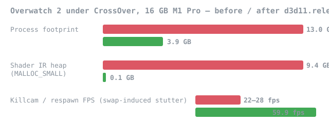

# DXMT — fork tuned for Overwatch 2 on Apple Silicon

This is a fork of [3Shain/dxmt](https://github.com/3Shain/dxmt) focused on making
**Overwatch 2 under CrossOver** run well on 16 GB Apple Silicon Macs. All credit for
DXMT itself goes to upstream — this fork adds targeted fixes and tooling on top.

**What this fork adds:**

- **`d3d11.releaseShaderIR`** (default on) — stock DXMT keeps the parsed IR of every
  shader resident forever. On OW2 that's ~9.4 GB of heap that is never read again once
  the variant is in the shader cache. This fork releases it eagerly and re-materializes
  from the stored DXBC only on a cache miss. Result on a 16 GB M1 Pro: process footprint
  13 GB → 3.9 GB, zero swap growth, killcam/respawn stutter gone (22–28 → 59.9 fps).
- **`DXMT_FRAME_LOG=<path-prefix>`** — per-frame CSV telemetry (frame interval, encode /
  drawable / latency-fence breakdown, shader compiles per frame) written straight from the
  present path. Buffered `fprintf`, no os_log, near-zero overhead. One file per process pid.
- **`dxgi.customVideoMemory`** — optional cap (MB) for the VRAM amount reported to the game.
- **Ready-made config** for flat-frametime 60 fps (see `dxmt.conf.example` in the
  [releases](../../releases)): frame pacing via `d3d11.preferredMaxFrameRate`, optional
  MetalFX spatial output upscaling.

**Quick start:** grab the latest [release](../../releases), unpack, `bash install.sh` (see [the 5-minute guide](docs/ow2-pack/INSTALL.md)).
It backs up the stock CrossOver DXMT first; `bash uninstall.sh` restores it.

**Shader cache expectations:** the persistent cache starts empty and fills as you play.
Every new hero, skin, ability effect, and map introduces shader variants that compile once
(a brief hitch) and are then cached forever. The first sessions will hitch noticeably more;
after a few days of varied play it settles and stays smooth. This is by design — the cache
is a per-machine artifact and is not distributable.

Tested on: M1 Pro 16 GB and MacBook Air M5 16 GB, CrossOver 26.3, macOS 26.5.
Issues and reports welcome.

---

# DXMT (upstream README)

A Metal-based translation layer for Direct3D 11 and 10 which allows running 3D applications on macOS using Wine.

For the current status of the project, please refer to the [project wiki](https://github.com/3Shain/dxmt/wiki).

The most recent development builds can be found [here](https://github.com/3Shain/dxmt/actions).

## Build

See [DEVELOPMENT.md](docs/DEVELOPMENT.md)

---

*If this fork saved your ranked games, you can [sponsor my work](https://github.com/sponsors/NerRobDog) —
it supports the packaging and investigation effort here, not DXMT itself.
Star [3Shain/dxmt](https://github.com/3Shain/dxmt) too — that's where the heavy lifting lives.*
